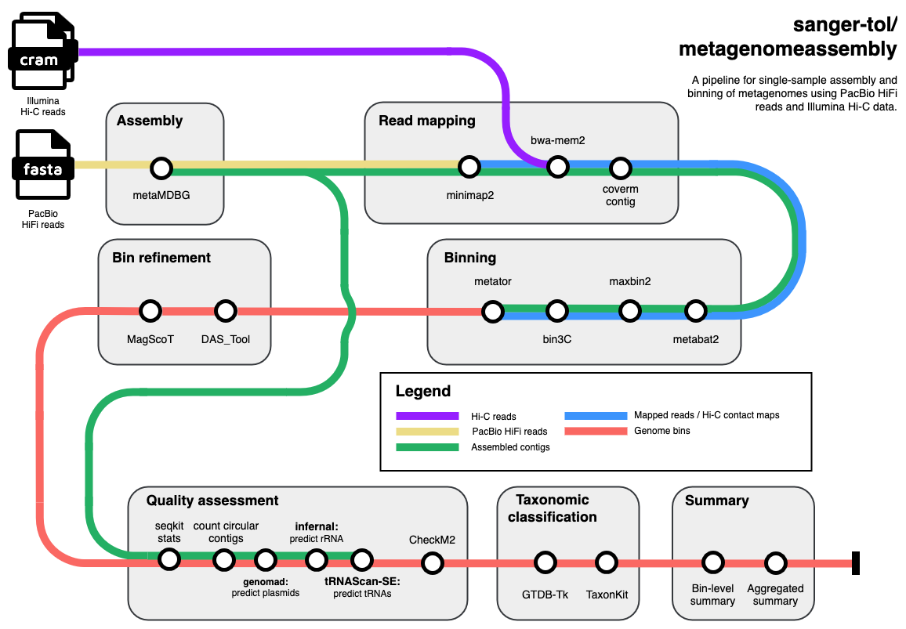

# sanger-tol/metagenomeassembly

[](https://github.com/sanger-tol/metagenomeassembly/actions/workflows/ci.yml)
[](https://github.com/sanger-tol/metagenomeassembly/actions/workflows/linting.yml)[](https://doi.org/10.5281/zenodo.15090769)
[](https://www.nf-test.com)

[](https://www.nextflow.io/)
[](https://docs.conda.io/en/latest/)
[](https://www.docker.com/)
[](https://sylabs.io/docs/)
[](https://cloud.seqera.io/launch?pipeline=https://github.com/sanger-tol/metagenomeassembly)

## Introduction

**sanger-tol/metagenomeassembly** is a bioinformatics pipeline for the assembly and binning of metagenomes
using PacBio HiFi data and (optionally) Hi-C Illumina data.



## Pipeline summary

1. Assembles raw reads using [metaMDBG](https://github.com/GaetanBenoitDev/metaMDBG).
2. Maps HiFi and (optionally) Hi-C reads to the assembly using [minimap2](https://github.com/lh3/minimap2) and [bwa-mem2](https://github.com/bwa-mem2/bwa-mem2).
3. Bins the assembly using [MetaBat2](https://bitbucket.org/berkeleylab/metabat/src/master/), [MaxBin2](https://sourceforge.net/projects/maxbin2/), [Bin3C](https://github.com/cerebis/bin3C) (Hi-C binning), and [Metator](https://github.com/koszullab/metaTOR/) (Hi-C binning).
4. (optionally) refine the bins using [DAS_Tool](https://github.com/cmks/DAS_Tool) and [MagScoT](https://github.com/ikmb/MAGScoT).
5. Assesses the completeness and contamination of bins using [CheckM2](https://github.com/chklovski/CheckM2) and assesses ncRNA content using [tRNAscan-SE](https://github.com/UCSC-LoweLab/tRNAscan-SE) for tRNA and [Infernal](http://eddylab.org/infernal/)+Rfam for rRNA.
6. Assigns taxonomy to bins using [GTDB-TK](https://github.com/Ecogenomics/GTDBTk/) and converts assignments to NCBI taxonomy labels.
7. Summarises information at the bin level.

## Usage

> [!NOTE]
> If you are new to Nextflow and nf-core, please refer to [this page](https://nf-co.re/docs/usage/installation) on how to set-up Nextflow. Make sure to [test your setup](https://nf-co.re/docs/usage/introduction#how-to-run-a-pipeline) with `-profile test` before running the workflow on actual data.

First, prepare a YAML with your input data that looks as follows:

`input.yaml`:

```yaml
id: SampleName
pacbio:
  fasta:
    - /path/to/pacbio/file1.fasta.gz
    - /path/to/pacbio/file2.fasta.gz
    - ...
hic:
  cram:
    - /path/to/hic/hic1.cram
    - /path/to/hic/hic2.cram
    - ...
  enzymes:
    - enzyme_name_1 (e.g. DpnII)
    - enzyme_name_1 (e.g. HinfI)
    - ...
```

Now, you can run the pipeline using:

```bash
nextflow run sanger-tol/metagenomeassembly \
   -profile <docker/singularity/.../institute> \
   --input input.yaml \
   --outdir <OUTDIR>
```

> [!WARNING]
> Please provide pipeline parameters via the CLI or Nextflow `-params-file` option. Custom config files including those provided by the `-c` Nextflow option can be used to provide any configuration _**except for parameters**_; see [docs](https://nf-co.re/docs/usage/getting_started/configuration#custom-configuration-files).

## Credits

sanger-tol/metagenomeassembly was originally written by Jim Downie, Will Eagles, Noah Gettle.

<!-- We thank the following people for their extensive assistance in the development of this pipeline: -->

## Contributions and Support

If you would like to contribute to this pipeline, please see the [contributing guidelines](.github/CONTRIBUTING.md).

## Citations

If you use sanger-tol/metagenomeassembly for your analysis, please cite it using the following doi: [10.5281/zenodo.15090769](https://doi.org/10.5281/zenodo.15090769)

An extensive list of references for the tools used by the pipeline can be found in the [`CITATIONS.md`](CITATIONS.md) file.

This pipeline uses code and infrastructure developed and maintained by the [nf-core](https://nf-co.re) community, reused here under the [MIT license](https://github.com/nf-core/tools/blob/main/LICENSE).

> **The nf-core framework for community-curated bioinformatics pipelines.**
>
> Philip Ewels, Alexander Peltzer, Sven Fillinger, Harshil Patel, Johannes Alneberg, Andreas Wilm, Maxime Ulysse Garcia, Paolo Di Tommaso & Sven Nahnsen.
>
> _Nat Biotechnol._ 2020 Feb 13. doi: [10.1038/s41587-020-0439-x](https://dx.doi.org/10.1038/s41587-020-0439-x).
